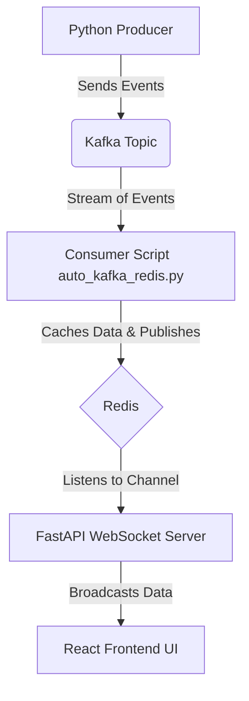
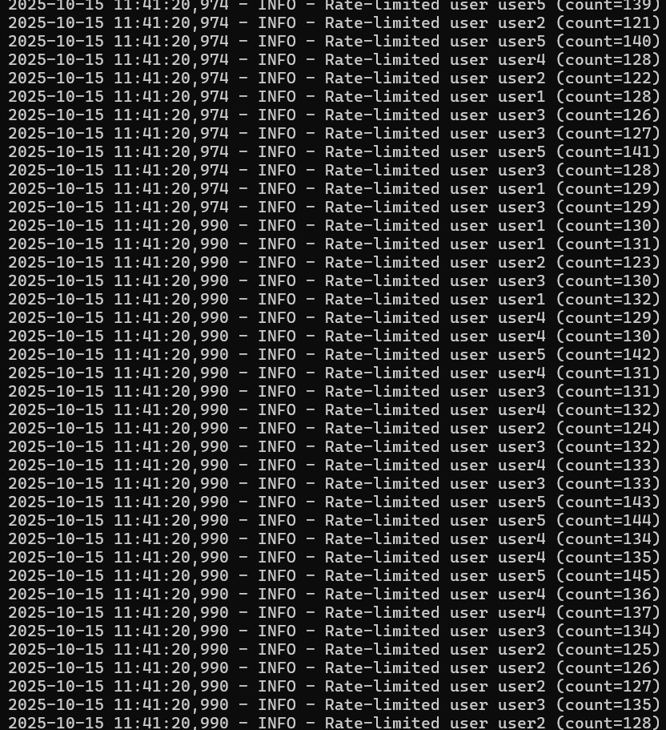
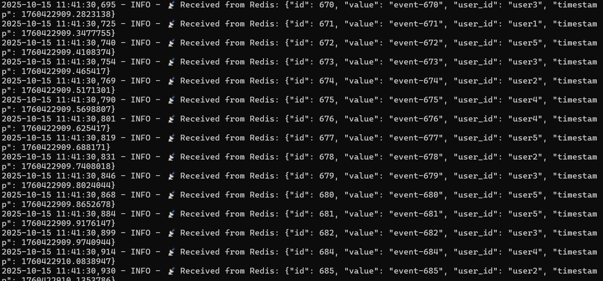
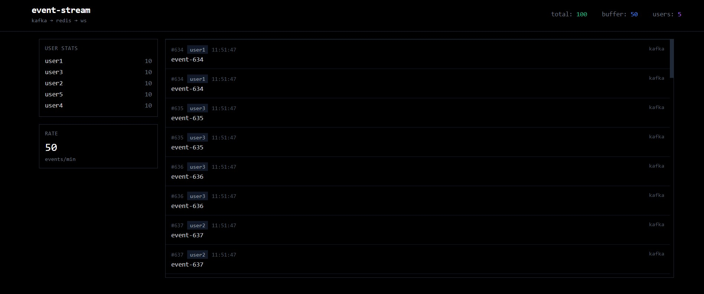

# 📊 Event Stream Dashboard

A real-time event monitoring dashboard that visualizes a data pipeline flowing from Kafka through Redis to a web-based UI via WebSockets.

## ✨ Overview

This project demonstrates a scalable, real-time data processing pipeline. A Python script **produces** events into a Kafka topic. A **consumer** service reads these events, processes them, and pushes them to Redis. A **FastAPI WebSocket server** listens to a Redis Pub/Sub channel and broadcasts incoming messages to all connected clients. Finally, a **React frontend** receives this data and displays it in a dynamic, real-time dashboard.

---

## 🏗️ Architecture & Data Flow

The data flows through the system in the following sequence:

1.  **Producer**: A Python script (`producer.py`) generates and sends event messages to a designated Kafka topic.
2.  **Kafka**: Acts as the distributed streaming platform, ingesting and storing the event stream reliably.
3.  **Consumer to Redis**: The `auto_kafka_redis.py` service consumes messages from the Kafka topic. It then caches the data in Redis and simultaneously publishes it to a Redis channel (`pub/sub`).
4.  **FastAPI & Redis Pub/Sub**: The `websocket_server.py` is subscribed to the Redis channel. Upon receiving a new message, it immediately pushes the data to all connected front-end clients through a WebSocket connection.
5.  **React Frontend**: The client-side application listens for WebSocket messages and updates the UI components in real-time to reflect the new data.

## Architecture


**Data Flow:**
1. Python producer sends events to Kafka topic
2. Consumer script reads from Kafka and pushes to Redis pub/sub
3. FastAPI server listens to Redis channel and forwards via WebSocket
4. React frontend displays events in real-time

## 🛠️ Tech Stack

-   **Backend**: Python, FastAPI
-   **Streaming**: Apache Kafka
-   **Caching & Pub/Sub**: Redis
-   **Frontend**: React
-   **Configuration**: YAML

---

## 🚀 Getting Started

### Prerequisites

-   Python 3.8+
-   Node.js and npm
-   Docker (Recommended for running Kafka and Redis)
-   An active Kafka and Redis instance.

### Installation & Setup

1.  **Clone the repository:**
    ```bash
    git clone <your-repo-url>
    cd event-stream-dashboard
    ```

2.  **Backend Setup:**
    -   Create and activate a virtual environment:
        ```bash
        python -m venv venv
        source venv/bin/activate  # On Windows use `venv\Scripts\activate`
        ```
    -   Install Python dependencies:
        ```bash
        pip install -r requirements.txt
        ```

3.  **Frontend Setup:**
    -   Navigate to the dashboard directory:
        ```bash
        cd dashboard
        ```
    -   Install npm packages:
        ```bash
        npm install
        ```

4.  **Configuration:**
    -   Update the `config.yaml` file with your Kafka and Redis server details (host, port, topic names, etc.).

### Running the Application

1.  **Start the Backend Services:**
    -   Run the Kafka to Redis consumer script:
        ```bash
        python auto_kafka_redis.py
        ```
    -   Run the FastAPI WebSocket server:
        ```bash
        uvicorn websocket_server:app --reload
        ```

2.  **Start the Frontend:**
    -   In the `dashboard` directory, run:
        ```bash
        npm start
        ```

3.  **Start the Producer:**
    -   To generate sample data, run the producer script in a new terminal:
        ```bash
        python producer.py
        ```
    -   Now, open your browser to `http://localhost:3000` to see the real-time updates!

---

## 📸 Screenshots

### Kafka Ingestion & Redis Publishing


### WebSocket Server Log


### Web UI Dashboard

